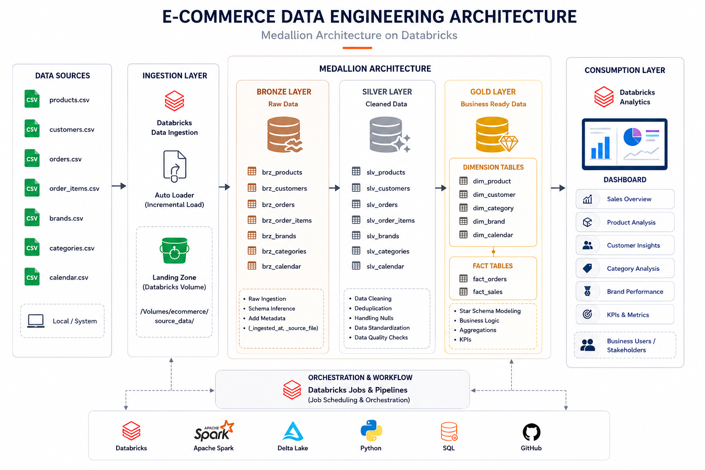
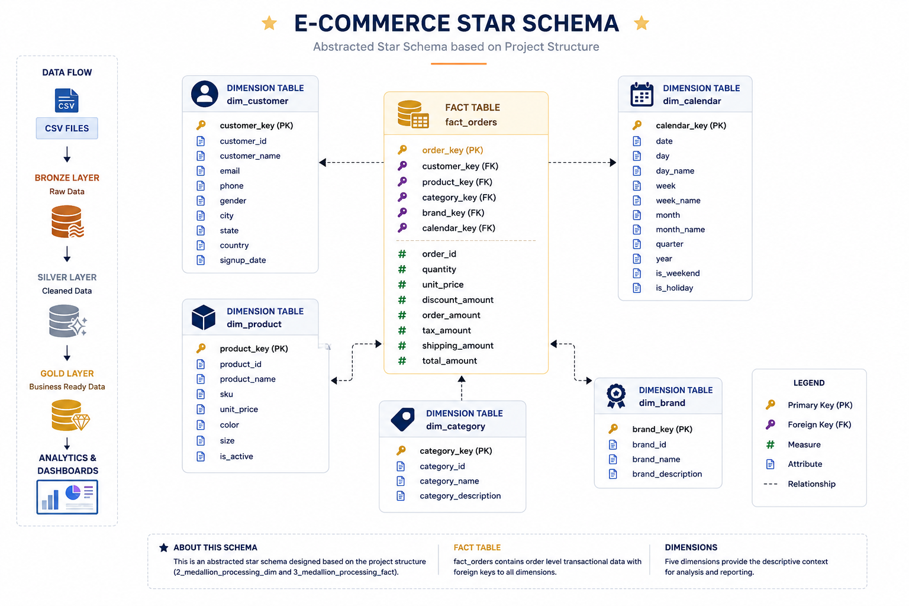
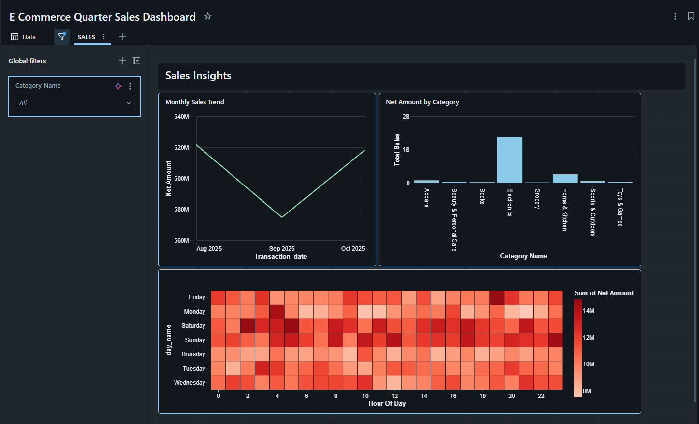

# 🚀 Enterprise E-Commerce Lakehouse Platform using Databricks

An end-to-end Data Engineering project built on Databricks implementing the Medallion Architecture (Bronze, Silver, Gold) to process raw e-commerce data into analytics-ready datasets using PySpark, Delta Lake, Unity Catalog, and Databricks Jobs & Pipelines.

---

## 📌 Project Overview

This project demonstrates a complete Data Engineering pipeline that ingests raw e-commerce data, transforms it through multiple layers of the Medallion Architecture, and delivers business-ready insights through Databricks Dashboards.

The pipeline follows industry best practices for data ingestion, transformation, governance, orchestration, and analytics.

## 🛠️ Technology Stack

- Databricks
- Apache Spark
- PySpark
- Delta Lake
- Unity Catalog
- Databricks Jobs & Pipelines
- Spark SQL
- Python
- DBFS (Databricks File System)
- Databricks SQL Dashboard
- Medallion Architecture
- Star Schema

---

## 📂 Project Structure

```
E-Commerce/
│
├── 1_setup/
│
├── 1_medallion_processing_dim/
│
├── 3_medallion_processing_fact/
│
├── architecture/
│   ├── medallion_architecture.png
│   └── star_schema.png
│
├── dashboard/
│   └── dashboard.png
│
└── README.md
```

---

## 📥 Data Ingestion

Raw CSV files are loaded into Databricks Volumes (Landing Zone) using PySpark.

Example datasets:

- Products
- Customers
- Orders
- Order Items
- Brands
- Categories
- Calendar

---

## 🥉 Bronze Layer

Purpose:

- Store raw ingested data
- Preserve original records
- Create Delta Tables
- Add metadata

Tables:

- brz_products
- brz_customers
- brz_orders
- brz_brands
- brz_category
- brz_calendar

---

## 🥈 Silver Layer

Purpose:

- Data Cleaning
- Remove duplicates
- Handle null values
- Standardize data
- Apply business rules

Tables:

- slv_products
- slv_customers
- slv_orders
- slv_brands
- slv_category
- slv_calendar

---

## 🥇 Gold Layer

Purpose:

- Business-ready datasets
- Analytical reporting
- Star Schema

Dimension Tables

- gld_dim_products
- gld_dim_customers
- gld_dim_brands
- gld_dim_category
- gld_dim_calendar

Fact Tables

- gld_fact_orders
- gld_fact_sales

---

## ⭐ Star Schema

Fact Table

- Fact Orders

Dimension Tables

- Product
- Customer
- Brand
- Category
- Calendar

---

## ⚙️ Pipeline Workflow

```
CSV Files
      │
      ▼
Databricks Volume
      │
      ▼
Databricks Jobs & Pipelines
      │
      ▼
Bronze Layer
      │
      ▼
Silver Layer
      │
      ▼
Gold Layer
      │
      ▼
Databricks Dashboard
```

---

## 📈 Features

- End-to-End ETL Pipeline
- Medallion Architecture
- Delta Lake Tables
- Data Quality Validation
- Star Schema Modeling
- Databricks Jobs & Pipelines
- Interactive Dashboards
- Scalable Data Processing
- Centralized Data Governance with Unity Catalog

---

## 🚀 Skills Demonstrated

- Data Engineering
- ETL Pipeline Development
- PySpark Transformations
- Delta Lake
- Spark SQL
- Data Modeling
- Star Schema Design
- Data Ingestion
- Data Cleaning
- Databricks
- Dashboard Development

---

## 📸 Project Screenshots


## 🏗️ Architecture

<p align="center">
  
</p>

---

## ⭐ Star Schema

<p align="center">
  
</p>

---

## 📊 Dashboard

<p align="center">
  
</p>

---

## 👨‍💻 Author

**Vipul Bhole**

Aspiring Data Engineer | Java Spring Boot Developer

LinkedIn: *https://www.linkedin.com/in/vipulbhole-*

GitHub: *https://github.com/vipulbhole26*
